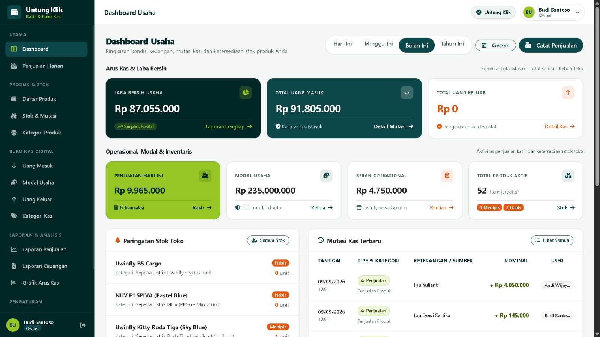
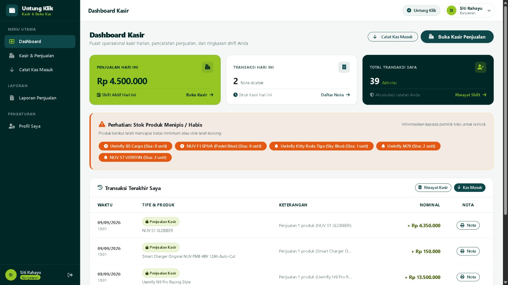

# UntungKlik — Sistem Kasir (POS) & Manajemen Keuangan UMKM

Aplikasi kasir (**Point of Sale**) dan manajemen keuangan usaha UMKM berbasis **Laravel 13** dengan **Bootstrap 5**. Dirancang untuk mengelola penjualan kasir, inventaris barang, arus kas masuk & keluar, modal usaha, beban operasional, serta laporan laba/rugi yang dapat diekspor ke format **PDF** dan **Excel**. Dilengkapi akun khusus untuk **Owner** dan **Karyawan (Kasir)**.

---

## Preview Tampilan Antarmuka

| 👑 Panel Owner (Pemilik Usaha) | 🧑‍💼 Panel Karyawan (Kasir POS) |
| :---: | :---: |
|  |  |
| *Dashboard analitik keuangan, grafik laba/rugi, manajemen stok & produk, beban operasional, dan pengaturan nota toko.* | *Antarmuka operasional kasir (Point of Sale), pencatatan kas masuk cepat, riwayat penjualan, dan cetak struk kasir thermal.* |

---

## Fitur Utama

- **Point of Sale (POS) & Kasir Cepat** — Transaksi penjualan multi-item, pencarian produk instan/barcode, kalkulasi diskon, perhitungan kembalian otomatis, dan cetak struk nota kasir thermal (58mm/80mm).
- **Pengaturan Nota & Toko** — Kustomisasi identitas toko pada struk kasir (nama toko, alamat, nomor telepon, footer nota, dan logo toko) dengan pratinjau langsung.
- **Katalog Produk & Kategori** — Kelola SKU, nama produk, kategori, harga beli (HPP), harga jual, margin keuntungan, dan status aktif/nonaktif.
- **Kontrol Stok & Histori Mutasi** — Pemantauan stok real-time, peringatan stok menipis (*low stock warning*) & habis, penyesuaian stok (*stock adjustment*), serta pencatatan kartu riwayat mutasi stok.
- **Arus Kas & Manajemen Keuangan** — Pencatatan transaksi kas masuk (penjualan, servis, jasa) dan kas keluar (kulakan, beban), entri penambahan modal usaha, serta pelacakan biaya operasional (sewa, listrik, internet, gaji).
- **Laporan Keuangan & Analitik** — Rekap laba/rugi, arus kas, dan laporan penjualan per periode (hari ini, minggu ini, bulan ini, tahun ini, atau rentang tanggal kustom).
- **Ekspor Dokumen (PDF & Excel)** — Cetak dan unduh laporan keuangan serta laporan penjualan langsung dalam format PDF siap cetak (`barryvdh/laravel-dompdf`) dan spreadsheet Excel (`maatwebsite/excel`).
- **Visualisasi Grafik Interaktif** — Analisis tren pendapatan, distribusi pengeluaran operasional, dan performa laba bersih menggunakan grafik interaktif berbasis **Chart.js**.
- **Autentikasi Cepat Berbasis PIN** — Login aman menggunakan kombinasi Username dan PIN 4-digit, fitur Lupa/Reset PIN dengan token terenkripsi, serta pembaruan profil pengguna.
- **Role-Based Access Control (RBAC)**:
  - **Owner**: Akses penuh ke seluruh modul bisnis, keuangan, modal, beban, analisis grafik, manajemen kasir/user, dan pengaturan toko.
  - **Karyawan**: Akses khusus operasional kasir (POS), pencatatan transaksi masuk, serta laporan shift penjualan.
- **UI/UX Modern & Responsif** — Tampilan bersih menggunakan palet warna terstandarisasi (`#002626`, `#0E4749`, `#95C623`, `#E55812`), modal dialog interaktif dengan **SweetAlert2**, dan tata letak responsif desktop/mobile.

---

## Persyaratan Sistem

- PHP 8.3+ (atau PHP 8.4)
- Composer 2.x
- MySQL / MariaDB / SQLite (untuk testing)
- Ekstensi PHP: `ext-pdo`, `ext-gd`, `ext-zip`, `ext-fileinfo`
- Node.js tidak diwajibkan untuk menjalankan aplikasi (aset CSS dan JS telah terkompilasi mandiri di dalam direktori `public/`)

---

## Instalasi

```bash
# 1. Clone repositori
git clone <repo-url> untung-klik
cd untung-klik

# 2. Install dependensi composer
composer install

# 3. Konfigurasi berkas environment (.env)
copy .env.example .env        # Windows
# atau: cp .env.example .env  # Linux / macOS

# 4. Generate application key
php artisan key:generate

# 5. Jalankan migrasi database dan pengisian data awal (seeder)
php artisan migrate:fresh --seed

# 6. Buat tautan symlink storage (untuk foto logo nota & bukti transaksi)
php artisan storage:link

# 7. Jalankan server lokal
php artisan serve
```

Buka peramban Anda dan akses:
- Halaman Login: `http://127.0.0.1:8000/login`

> **Catatan:** Perintah `php artisan storage:link` wajib dijalankan agar file unggahan (seperti logo nota toko dan bukti dokumen) dapat diakses publik melalui `/storage/*`.

---

## Akun Demo

Semua akun bawaan dari seeder menggunakan PIN: **`2222`**

| Peran | Username | PIN | Deskripsi Akun |
| :--- | :--- | :--- | :--- |
| **Owner** | `owner` | `2222` | Pemilik Usaha / Admin Utama (Akses Penuh) |
| **Karyawan 1** | `karyawan1` | `2222` | Kasir & Teknisi Operasional (Siti Rahayu) |
| **Karyawan 2** | `karyawan2` | `2222` | Kasir & Teknisi Operasional (Andi Wijaya) |

---

## Data Seeder

`DatabaseSeeder` telah dilengkapi dengan data percontohan riil usaha **Galeri E-Bike Uwinfly & NUV (Dealer Resmi Sepeda & Motor Listrik)**:
- **Pengguna**: 1 Akun Pemilik (Owner) dan 2 Akun Staf Kasir (Karyawan).
- **Profil Usaha**: Identitas lengkap dealer resmi beserta konfigurasi struk kasir.
- **Katalog Produk**: 5 kategori produk (Sepeda Listrik Uwinfly, Motor Listrik, Sepeda Listrik NUV, Baterai & Charger, Suku Cadang/Sparepart) lengkap dengan SKU, HPP, harga jual, dan stok awal.
- **Keuangan**: Entri modal awal & tambahan usaha senilai Rp 235.000.000, biaya sewa ruko, listrik showroom, internet, bensin armada antar unit, dan gaji karyawan.
- **Transaksi**: Histori penjualan unit sepeda/motor listrik, jasa servis/penggantian aki, transaksi kas masuk & keluar, dan mutasi kartu stok barang.

---

## Menjalankan Pengujian

Proyek ini dilengkapi pengujian otomatis menyeluruh (**Pest PHP**) untuk memvalidasi alur autentikasi PIN, modul kasir, transaksi penjualan, manajemen inventaris, laporan keuangan, dan pengaturan nota:

```bash
# Menjalankan seluruh pengujian dengan output ringkas
php artisan test --compact

# atau menggunakan binary Pest langsung
vendor\bin\pest             # Windows
./vendor/bin/pest           # Linux / macOS
```

*Status pengujian saat ini: **42 passed**, **226 assertions**.*

---

## Teknologi

- **Backend**: [Laravel 13](https://laravel.com), PHP 8.3+, Eloquent ORM
- **Frontend**: Blade Templating, [Bootstrap 5.3](https://getbootstrap.com), [Font Awesome 6.5](https://fontawesome.com), [SweetAlert2 11](https://sweetalert2.github.io)
- **Visualisasi Data**: [Chart.js](https://www.chartjs.org)
- **Ekspor Dokumen**: [barryvdh/laravel-dompdf](https://github.com/barryvdh/laravel-dompdf) & [maatwebsite/excel](https://github.com/SpartnerNL/Laravel-Excel)
- **Pengujian**: [Pest PHP 5](https://pestphp.com) & Laravel Testing Suite
- **Tipografi**: Plus Jakarta Sans

---

## 💖 Dukungan & Donasi

Jika proyek **UntungKlik** ini bermanfaat bagi Anda, membantu usaha Anda, atau telah menghemat banyak waktu kerja Anda dalam mengembangkan sistem POS dan manajemen keuangan UMKM, Anda dapat menunjukkan apresiasi dengan memberikan traktiran kopi (donasi) melalui pemindaian kode QRIS di bawah ini:

<p align="left">
  
</p>

---

Copyright (c) 2026 **Yanuar Ardhika Rahmadhani Ubaidillah**
